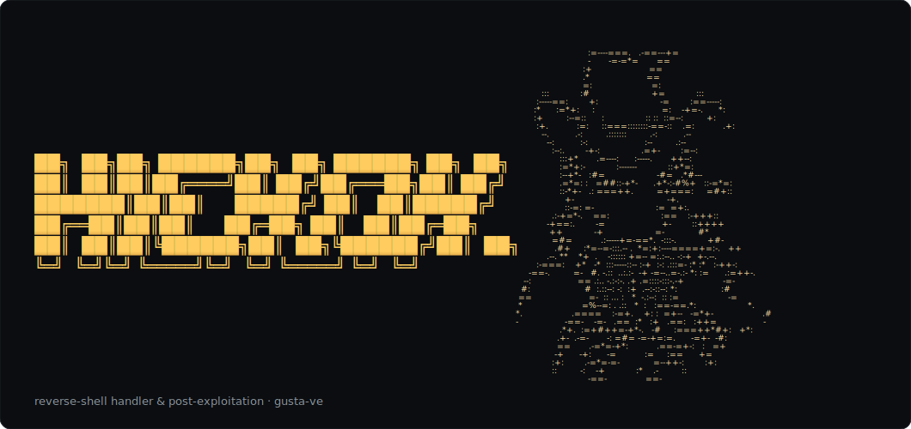

# hickok

<p align="center">
  
</p>

A reverse-shell handler and post-exploitation console. Catch shells on multiple
listeners, run commands, upgrade to a full PTY, generate reverse-shell one-liners,
and walk a SQL injection end-to-end — from one dependency-free CLI.

It's the other half of a hand: [**wraith**](https://github.com/gusta-ve/wraith)
holds the aces — it does the recon and proves the way in; **hickok** brings the
eights — it acts on what wraith caught. Aces and eights, the *dead man's hand*.

[](https://pypi.org/project/hickok/)
[](https://github.com/gusta-ve/hickok/actions/workflows/ci.yml)
[](https://github.com/gusta-ve/hickok/releases)


- [Install](#install)
- [Usage](#usage)
- [SQL injection](#sql-injection--hickok-sql)
- [The bridge](#the-bridge--hickok-call)
- [Showdown mode](#showdown-mode--hickok-showdown)

## Install

```bash
pipx install hickok
```

Or from a clone: `pip install -e .` — or run it with no install at all:
`PYTHONPATH=src python3 -m hickok`.

## Usage

The listener is the default command, so a bare `hickok` starts catching shells:

```bash
hickok                                   # listen on :9001, drop into the console
hickok -l 9001,9002 --lhost 10.10.14.7   # multiple listeners, fixed LHOST
hickok payloads 10.10.14.7 9001          # print reverse-shell one-liners
hickok call                              # act on wraith's latest run (found on its own)
hickok call path/to/findings.json        # ...or a specific one
hickok sql -u 'http://host/p?id=1' -p id # walk a SQL-injectable parameter
hickok hand                              # lay down the dead man's hand (the reveal)
hickok showdown                          # toggle "showdown mode" — a landed shell plays out
```

Inside the console:

```
hickok>
  sessions          list connected shells
  payloads          reverse-shell one-liners for your LHOST
  cmd 1 id          run a command on session 1
  upgrade [1]       full PTY, sized to your terminal (id optional if only one)
  interact [1]      attach (detach with Ctrl-])
  kill [1]          drop a session
```

A dropped shell announces itself (no silently-lost footholds), and every session
is **logged to a transcript** under `~/.local/share/hickok/sessions/` for your
report. `upgrade` spawns a PTY *and* matches its `TERM` and window size to your
terminal, so `clear`, `vi` and friends behave once you `interact`.

## SQL injection — `hickok sql`

Walk a database through SQL injection — find the way in and read it out. hickok
calibrates the injection, fingerprints the DBMS (SQLite / MySQL / MSSQL /
PostgreSQL) and picks the fastest technique automatically:

- **union** — when the page reflects query output, it reads whole values (and
  whole tables, via `group_concat`) in *one* request. A full walk that takes
  ~1000 blind requests is a handful here.
- **boolean-blind** — otherwise, it binary-searches each character through a
  TRUE/FALSE oracle (error-forcing when a false page barely changes).
- **time-based** — when *nothing* leaks (same page, no reflection), it asks
  through a conditional sleep and times the response. Slow, but universal.

Force one with `--technique union|blind|time` (default `auto`, fastest first).

```bash
hickok sql -u 'http://host/db?id=1' -p id   # or just `hickok sql` to read it
                                            # from wraith's latest SQLi finding
```

On entry it prints the DBMS and the database(s) it can see, so you have somewhere
to start digging:

```
hickok(sql)>
  banner            DBMS version             user / db        current user / database
  databases         list databases           tables           list tables
  columns <table>   a table's columns        dump <table>     dump its rows
  query "<SELECT>"  extract one value        help / exit      this / quit
```

```
hickok(sql)> dump users
  id | username | password
  ---+----------+-----------
  1  | admin    | s3cr3t!
  2  | alice    | wonderland
  [+] 2 row(s) saved → ~/.local/share/hickok/sql/127.0.0.1_id_…/dump/main/users.csv
```

Everything for a target lands in **one folder** —
`~/.local/share/hickok/sql/<host>_<param>_<id>/` — holding `target.txt` (what was
run), `log.txt` (the run, colour-stripped), `cache.jsonl` (the resume cache) and
`dump/<database>/<table>.csv` (every `dump`, organised by database, path printed).
Pass `-o DIR` / `--output DIR` to drop the dumps straight into your engagement folder
(keeping the `<database>/<table>.csv` layout) instead of the default data dir.

**Filtered / WAF'd targets.** String literals go in **quote-free** — a hex
literal on MySQL, `char()` / `chr()` elsewhere — so a target that strips single
quotes still reflects and dumps where a quoted payload would come back empty.
And when the catalog (`information_schema`) is blocked, hickok **guesses names**
instead: common table/column names plus `<db>_<name>` and CMS prefixes (`wp_`,
`phpbb_`, …), probed by name with no catalog in the payload.

Boolean-blind is slow by nature (each character is binary-searched over many
requests) — it turns a live heartbeat with the running count as it goes, and
**Ctrl-C keeps what it pulled** and drops back to the console.

Every value is **cached per target** as it's extracted, so you never pay for it
twice: re-run and anything pulled before comes back instantly (zero requests),
and a walk you interrupted resumes exactly where it stopped. `--fresh` ignores
the cache and re-extracts.

**Evasion / OPSEC:**

```bash
hickok sql -u '...' -p id --ghost  # one flag: Tor (fail-closed) + random UA + throttle

hickok sql -u '...' -p id \        # …or set the pieces yourself:
  --random-agent \                 # a random real browser User-Agent
  --tor \                          # route via Tor, verified (see below)
  --cookie 'sid=…' -H 'X-Api: …' \ # authenticated injection
  --delay 0.3 -v 2 \               # throttle; print every payload
  --dump users -o ./loot           # non-interactive: dump to ./loot/users.csv and exit
```

`--ghost` is the max-opsec preset — the safest footprint in one word (Tor +
random UA + low-and-slow), each piece still overridable with its own flag. The
identical flag is in [wraith](https://github.com/gusta-ve/wraith).

`--tor` is **zero-dependency, leak-aware and fail-closed**: hickok speaks SOCKS5
itself (stdlib), auto-detects the Tor port (9050 / 9150), resolves the target
hostname **through Tor** (no DNS leak), and **verifies the exit is a Tor node
before sending any attack traffic** — if it can't confirm, it aborts rather than
deanonymising you. You only need Tor running (`sudo systemctl start tor`). Check
your setup first with `hickok sql --check-tor --tor`. `--proxy http://host:port`
and `--proxy socks5://host:port` work too.

## The bridge — `hickok call`

`hickok call` picks up wraith's latest run on its own — wraith writes to a fixed
per-user dir (`~/.local/share/wraith/runs/`, or wherever `WRAITH_RUNS` points)
that both tools agree on, so it works from any directory. It reads the table,
lists what wraith found, and flags every finding that means **code execution**
(command injection, SSTI, …) — those are the doors to a shell.

```bash
hickok call                          # wraith's latest run, wherever you are
hickok call path/to/findings.json    # ...or a specific one
```

```
  [Critical] Command Injection in 'host'   http://target/ping   ⮕ shell
  [High]     SSTI in 'name'                http://target/render ⮕ shell
  [High]     Reflected XSS in 'q'          http://target/search
```

`hickok hand` lays down the dead man's hand — in the terminal the gunslinger
rises first, then the cards:

```
    ╭───────╮   ╭───────╮   ╭───────╮   ╭───────╮   ╭───────╮
    │ A     │   │ A     │   │ 8     │   │ 8     │   │╱╲╱╲╱╲╱│
    │   ♠   │   │   ♣   │   │   ♠   │   │   ♣   │   │╱╲╱╲╱╲╱│
    │     A │   │     A │   │     8 │   │     8 │   │╱╲╱╲╱╲╱│
    ╰───────╯   ╰───────╯   ╰───────╯   ╰───────╯   ╰───────╯

  aces and eights — the dead man's hand.
```

wraith deals the aces; hickok brings the eights. The hand is complete.

## Showdown mode — `hickok showdown`

`hickok showdown` toggles a mode that sticks between runs. While it's on, the
moment a reverse shell lands the listener plays the catch out: the gunslinger
rises, lays down the dead man's hand, and calls it — *the house folds.* The reward
is for actually getting in; plain runs and a plain listener stay quiet. Run
`hickok showdown` again to turn it off.

## A range to practice on

New to this, or want a safe target to sharpen `hickok sql` against?
[**deadwood**](https://github.com/gusta-ve/deadwood) is a local, leveled
web-security range (tutorial → impossible) built for exactly this — point hickok
at a room and walk it:

```bash
pipx install deadwood-sec && deadwood serve
hickok sql -u 'http://127.0.0.1:8666/l/first-blood/app?id=1' -p id --dump secrets
```

## Tests

```bash
pip install -e ".[dev]" && pytest
```

## Disclaimer

Built for authorized security testing and research — point it where you're meant
to. What anyone does with it from there is theirs alone; the author takes no
responsibility for misuse.

## License

MIT.

---

*in memory of Wild Bill Hickok — shot holding aces and eights, Deadwood, 1876.*
